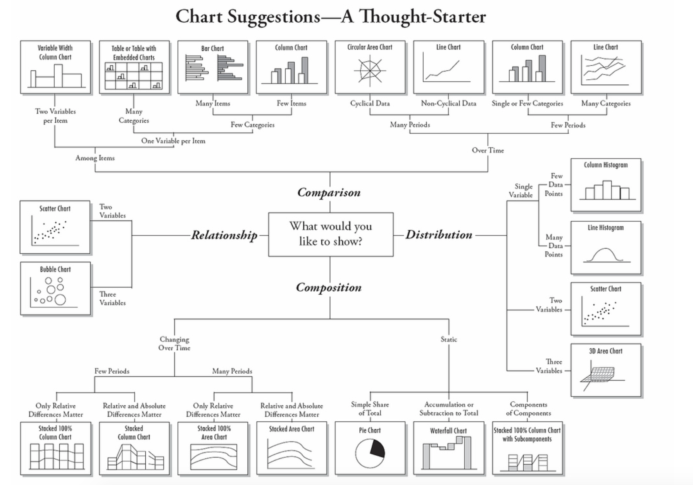
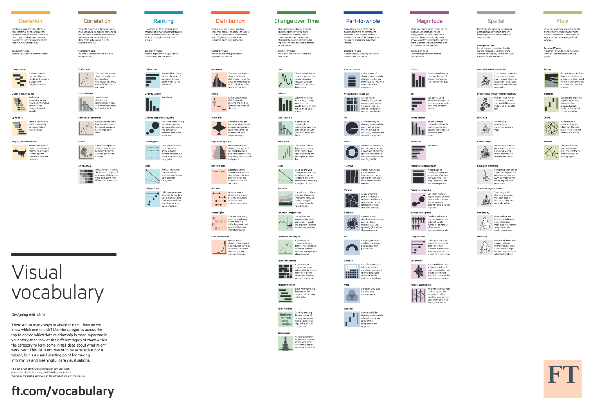
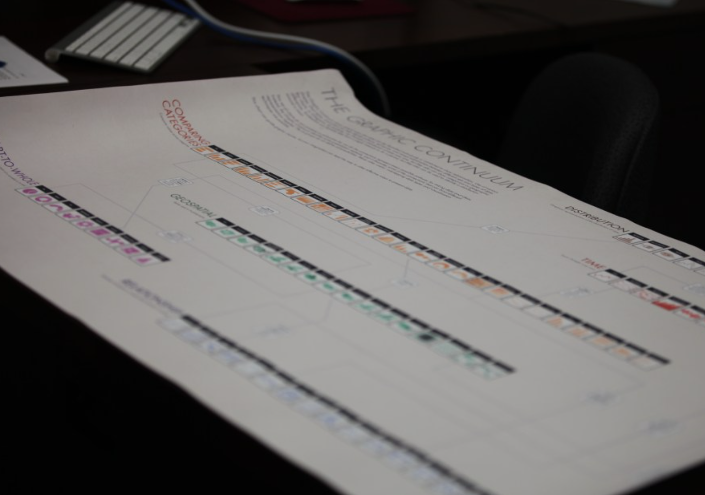

# Taller de periodismo de datos

[Link a la presentación](https://docs.google.com/presentation/d/1_6ld4C2TEyA1nTydTN1pQt3n4uiBWZ5KOIXQkw7vEBI/edit#slide=id.p)

======

#### Del 23 al 27 de abril, Agencia Efe
#### Instructor: Adrián Blanco
#### [adrianblanco.github.io](https://adrianblanco.github.io/)

======

### Esquema del curso

## I. <a href="#intro">Caja de herramientas del periodista de datos</a> (4h)

* ¿Qué es el periodismo de datos?
* Fuentes: ¿Dónde puedo encontrar datos para mis historias?
* Propuestas de proyectos a realizar durante el curso

## II. <a href="#analisis">Análisis de datos</a> (4h)

* Extracción y limpieza de datos
* Operaciones estadísticas básicas
* Aprende a trabajar con Excel y Google Spreadsheet

## III. <a href="#visualizacion">Visualización de datos</a> (4h)

* Gráficos, mapas y herramientas gráficas para mejorar mis artículos
* Cómo diseñar gráficos con Datawrapper
* Visualización avanzada con Flourish

## IV. <a href="#storytelling">De los datos a la historia</a> (4h)

* Cómo encajar los datos dentro de la historia
* Storytelling
* Edición del proyecto final

=========

## I. <a href="#intro">La caja de herramientas del periodista de datos</a>e (4h)

### ¿Qué es el periodismo de datos?


"If you torture the data long enough, it will confess to anything"

— ['How to lie with statistics' por Darrell Huff, ](http://faculty.neu.edu.cn/cc/zhangyf/papers/How-to-Lie-with-Statistics.pdf)

 “En vez de quedarse con esa información y practicar el periodismo Gollum, quedarse con el anillo y no compartirlo, decidieron compartirlo con el Consorcio, porque entendieron que era un tema global que tocaba a más de 200 países”

— [Mar Cabra, editora de la unidad de datos del ICIJ, ](http://www.unidiversidad.com.ar/mar-cabra-y-el-periodismo-gollum)

"Los datos pueden ser la fuente del periodismo de datos, o pueden ser la herramienta con la que se narra la historia o ambas cosas. Como cualquier fuente, debe tratarse con escepticismo; y como cualquier herramienta, debemos ser conscientes de cómo puede modelar y limitar las historias que se crean con la misma"

— [Paul Bradshaw, Birmingham City University](http://interactivos.lanacion.com.ar/manual-data/introducci%C3%B3n_0.html)

### Fuentes: ¿Dónde puedo encontrar datos para mis historias?

Una de las primeras preguntas que nos podemos hacer cuando nos encargan una historia o tengo una idea para desarrollar es, ¿dónde puedo acceder a los datos que apoyen a mi historia?

No existe una fórmula mágica, dependerá del tema, del tipo de historia, de las fuentes oficiales disponibles. Incluso, a veces no habrá datos y tendremos que solicitarlos o construir nuestra propia base de datos.

#### Fuentes estadísticas oficiales

Para la mayoría de temas del día a día, y desde un contexto español, podemos servirnos de dos fuentes de datos principales:

* [Instituto Nacional de Estadística (INE)](http://www.ine.es/). Es probablemente la fuente de datos y estadísticas más completa de España. Prácticamente cualquier estadística oficial que busquemos

* [Eurostat](http://ec.europa.eu/eurostat/): es el portal estadístico europeo. Podemos trabajar directamente con las bases de datos que ofrece o consultar los resumenes que publica. Existen diferentes guías sobre cómo manejarnos en Eurostat. Vamos a ver un ejemplo durante el taller, en cualquier caso aquí quedan algunas de ellas: [Cómo utilizar Eurostat (en inglés)](http://ec.europa.eu/eurostat/statistics-explained/index.php/Accessing_European_statistics) y [Statistics explained](http://ec.europa.eu/eurostat/statistics-explained/index.php/Main_Page/es).

Además, en caso de que sepamos utilizar R, un software estadístico, podemos trabajar con más facilidad con los datos mediante el paquete [Eurostat](http://ropengov.github.io/r/2015/05/01/eurostat-package-examples/)


#### Fuentes oficiales de otros países:

* [Office for National Statistics (ONS)](https://www.ons.gov.uk/)
* [Oficina estadísitica federal alemana - Destatis](https://www.destatis.de/EN/Homepage.html)
* [Insee - National Institute of Statistics and Economic Studies](https://www.insee.fr/en/accueil)
* [Todas las oficinas estadísticas oficiales europeas](http://www.ine.es/serv/estadist.htm)

#### Open Data | Datos abiertos

¿Qué son los datos abiertos?

Los datos abiertos son datos que pueden ser utilizados, reutilizados y redistribuidos libremente por cualquier persona, y que se encuentran sujetos, cuando más, al requerimiento de atribución y de compartirse de la misma manera en que aparecen.

— [Open Data Handbook](http://opendatahandbook.org/guide/es/what-is-open-data/)

En España, desde que en 2013 se aprobase la ley de Transparencia, las instituciones, las comunidades y los ayuntamientos han comenzado a publicar datos en formato abierto, aunque a veces no son tan abiertos como los pintan. Un ejemplo: un .pdf nunca será un formato abierto y todavía siguen publicando en este tipo de formatos.

Algunos ejemplos son:

* [Portal de datos abiertos de Madrid](https://datos.madrid.es/portal/site/egob/)
* [Barcelona, portal de datos abiertos](http://opendata-ajuntament.barcelona.cat/es/)
* [Open Data in Github](https://github.com/collections/open-data)

#### Fuentes privadas abiertas

También hay fuentes de datos abiertos en la web a las que podemos acudir:

* [ProPublica Data Store](https://www.propublica.org/datastore/): Un ejemplo es el de la organización sin ánimo de lucro destinada a la investigación, Propublica.
ProPublica cuenta con un repositorio con todos los datos que ha utilizado en las historias que ha publicado.
* [FiveThirtyEight](https://data.fivethirtyeight.com/)
* [Cool Datasets](https://www.cooldatasets.com/)
* [Data is plural](https://tinyletter.com/data-is-plural)

#### Cómo buscar fuentes

A través de Google y mediante la búsuqeda avanzada pueden buscarse fuentes utilizando la siguiente sintáxis. Si introducimos en el buscador:

```

término de búsuqeda filetype:tipo_de_archivo site:url


```


Un ejemplo:

```

índice general precios vivienda filetype:xls site:gob.es


```

¿Y si no hay datos?

#### Solicitudes de acceso a la información

Conocidas como FOIAs en inglés. Es aquella solicitud que presentamos a una administración amaparados por la ley de Trasnparencia española.

Es otra opción de la que debe valerse cualquier periodista de datos. En especial, cuando trabaja en un tema para el que no hay datos públicos pero sí podrían estar en posesión de la Administración. Para poder desenvolverse correctamente, lo fundamental es conocer 'al dedidllo' la [Ley 19/2013, de 9 de diciembre, de Transparencia, Acceso a la Información Pública y Buen Gobierno](http://transparencia.gob.es/transparencia/transparencia_Home/index/MasSobreTransparencia/Ley-de-Transparencia.html).

En la mayoría de los casos, para poder realizar esta solicitud, debemos acudir al [Portal de Transparencia](http://transparencia.gob.es/).

Vamos a ver algunos de los puntos clave:

* Artículo 2. Ámbito subjetivo de aplicación. A quién se aplica, es decir a quién podemos solicitar la información.

* Límites del derecho de acceso (art. 14 de la Ley 19/2013). Artículo 14. Límites al derecho de acceso: El derecho de acceso podrá ser limitado cuando acceder a la información suponga un perjuicio para: La seguridad nacional, La defensa,	Las relaciones exteriores (...)

* Causa de inadmisión (art. 18 de la Ley 19/2013)

* Protección de datos personales. (art. 15 de la Ley 19/2013)

Si tenemos en cuenta estos condicionantes, prácticamente somos capaces de presentar una solicitud adecuada. Para ello, podemos utilizar la siguiente plantilla como base:

```
Estimado [Ministerio u organismo de la Admon. Pública],

En virtud de la Ley 19/2013 de Transparencia, Acceso a la Información Pública y Buen Gobierno, les solicito la siguiente información relativa al uso de la infraestructura viaria  por parte de empresas privadas con detalle de:

[CONTENIDO DE LA SOLICITUD]

En caso de que la información no se encuentre tal y como pido en esta solicitud, me gustaría que se me entregue tal y como consta en los registros públicos, para evitar así cualquier acción previa de reelaboración.

Les agradecería que me pudieran remitir la información solicitada en uno de estos formatos: .csv, .txt, .xls ó .xlsx

Les recuerdo que disponen de un plazo máximo de un mes para remitir dicha información.

Muchas gracias
```

Una vez presentada la solicitud, debemos tener en cuenta los siguientes condicionantes con respecto a los tiempos de espera para recbibir los datos. Es importante:

* Un mes para responder a nuestra solicitud desde el inicio de la tramitación.

* Ese mes puede extenderse con otro mes de prórroga en caso de que la Administración necesite más tiempo para tramitar la solicitud. Es decir, en general, podrían respondernos en el plazo de una semana a dos meses.

* Por tanto, es importante que guardemos registro del día en que presentamos la solictud y estemos atentos al día de respuesta límite.

En ocasiones, nos denegarán la solicitud. Si nuestra petición está justificada podemos recurrir al Consejo de Transparencia y Buen Gobierno (CTBG).


[El modelo de reclamación](http://www.consejodetransparencia.es/ct_Home/te-ayudamos/Formularios.html) puede encontrarse en la web del CTBG. En él debemos argunentar por qué consideramos que no se está atendiendo a nuestro derecho de acceso a la información y justificarlo de acuerdo a los artículos de la ley. También podemos servirnos de [los criterios interpretativos](http://www.consejodetransparencia.es/ct_Home/Actividad/criterios.html) del CTBG sobre aspectos muy concretos de la ley.


#### Y si sigo sin tener datos, creo mi propia bbdd

Es lo que pensamos al realizar este proyecto sobre la violencia de género en España. Las estadísticas que proporciona el ministerio XXXX son muy pobres así que decidimos recopilar una base de datos más completa con cada caso.

Es sólo un ejemplo, alrededor nuestro hay miles de documentos desperdigados a los que si encontramos un encuadre, podemos construir nuestra propia base de datos.

Para ello, simplemente hay que tener en cuenta:

* Cómo vamos a estructurar esa base de datos. Es fundamental para poder manejar más tarde los datos de forma adecuada.
* Los nombres de las variables deen ser sencillos. Si es necesario incluiremos un archivo de metadatos explicando cada una de las variables.

========

¡OJO!
#### .pdf 😱

Como periodistas de datos, ¿cómo podemos combatir al .pdf?

La opción más efectiva es mediante OCR (Optical Character Recognition).

¿Qué es el OCR?

El reconocimiento óptico de caracteres es un proceso dirigido a la digitalización de textos, los cuales identifican automáticamente a partir de una imagen símbolos o caracteres que pertenecen a un determinado alfabeto, para luego almacenarlos en forma de datos. Así podremos interactuar con estos mediante un programa de edición de texto o similar.

Para poder servirnos de OCR necesitamos ciertos conocimiento de programación. En cualquier caso, existen alternativas gratuitas que aplican esta tecnología y comvierten un .pdf en un archivo del formato que indiquemos. Algunas opciones son:

* [Cometdocs](https://www.cometdocs.com/)
* [AdobePro](https://acrobat.adobe.com/es/es/acrobat/acrobat-pro.html)
* [OnlineOCR](https://www.onlineocr.net/es/)

Vamos a hacer una prueba con CometDocs donde convertiremos un archivo .pdf en un archivo .xls o Excel. Descargamos el archivo .pdf 'Datos y Evoluciones Violencia de Genero - Año 2017' del [siguiente enlace](http://www.poderjudicial.es/cgpj/es/Temas/Estadistica-Judicial/Estadistica-por-temas/Datos-penales--civiles-y-laborales/Violencia-domestica-y-Violencia-de-genero/Datos-sobre-Violencia-sobre-la-mujer-en-la-estadistica-del-CGPJ/) y seguimos los siguientes pasos:

* Entramos en [Cometdocs](https://www.cometdocs.com/)
* Arrastramos el archivo que queremos convertir y lo subimos a la plataforma.
* Seleccionamos el tipo de archivo al que queremos convertir el .pdf.
* Introducimos nuestro e-mail para que nos envíen el archivo convertido en unos segundos.

Una vez tengamos el archivo en .xls, OCR no es perfecto, por lo que en este momento tendremos que aplicar ciertas técnicas de limpieza de datos. En la mayoría de los casos deberemos servirnos de seleccionar filas y columnas del Excel que hayamos exportado, ayudándonos de los filtros.

¡Ojo! Si identificamos que los errores al transformar el pdf en un excel son recurrentes y muy similares (ej: siempre confunde el número 1 con la letra l o existen varios nombres o valores repetidos con errores como Marï@), podemos automatizar esa limpieza con [OpenRefine](http://openrefine.org/).

========

Cuando ya tenemos nuestra base de datos en bruto, es momento de tener en cuenta ciertos condicionantes de esos datos. Son los siguientes:

### Formatos

Una vez tengo localizadas la fuente que voy a utilizar es muy importante,

* .xls, .xlsx: es el formato en el que Excel guarda un conjunto de datos en formato tabla. Se puede abrir y trabajar con él con Excel, LibreOffice, OpenOffice, Google Spreadsheet...
* .csv: documento en formato abierto sencillo para representar datos en forma de tabla, en las que las columnas se separan por comas y las filas por saltos de línea.
* .tsv: documento en formato abierto sencillo para representar datos en forma de tabla, en las que las columnas se separan por tabulaciones y las filas por saltos de línea
* .json: es un formato ligero de intercambio de datos. Leerlo y escribirlo es simple para humanos, mientras que para las máquinas es simple interpretarlo y generarlo. [Más info](https://json.org/json-es.html)
* .pdf: es el mayor enemigo del periodista de datos. Formato de documento portátil es un formato de almacenamiento para documentos digitales. Es de tipo compuesto ya que incluye imagen vectorial, mapa de bits y texto.
* Formato web, HTML: En estos casos si los datos no se pueden copiar o si a pesar de que podemos copiarlos no podemos pegarlos o exportarlos en un formato adecuado, la única opción que no queda es extraer los datos de la web de forma automatizada. En inglés, a este proceso se le conoce como web scraping. Implica conocer un lenguaje de programación como, por ejemplo, Python.

Si lo nuestro no es la programación, existen algunas herramientas gratuitas que pueden facilitarnos el trabajo como son:

* [Import.io](https://www.import.io/)
* [Web scraper](http://webscraper.io/)
* [Tabula](http://tabula.technology/)

### Tipo o formato de los valores o datos

Además del formato del archivo, otro concepto clave es el tipo de dato de cada una de nuestras variables. En función del programa o lenguaje de programación existen diferentes tipos de datos. Los principales para trabajar con Excel o spreadsheet son:

* Texto o string
* Numérico
* Fecha
* Formato personalizado

Vamos a verlo sobre el propio programa.

#### Propuestas de proyectos a realizar durante el curso

El objetivo del curso es que desarrolléis una historia con datos durante esta semana.

Para ello:

* Identifica un tema que sea de tu interés y expón la tesis que quieras afirmar o refutar.
* Busca bases de datos que apoyen o refuten ese tema.
* Identifica el formato de cada una de ellas y analiza cómo puedes trabajar con ellas.
* Prepara un guión con los datos que vas a utilizar y la historia que vas a contar.

## II. <a href="#analisis">Análisis de datos</a> (4h)

Para la fase de análisis de datos, vamos a trabajar con la siguiente estadísitica sobre datos de violencia de género disponible en [el Minsiterio de Sanidad, Servicios Sociales e Igualdad](http://estadisticasviolenciagenero.msssi.gob.es/).

Durante el ejercicio, que podéis encontrar en [este enlace](https://docs.google.com/spreadsheets/d/1Vc31DKJIXdB9bg0pcGKFj0h1mI5XfNm4ahOtyODpy34/edit?usp=sharing) vamos a realizar los siguientes procesos.

#### Extracción y limpieza de datos

Lo haremos con Google spreadsheet o Excel aunque para determinadas también podríamos utilizar Open Refine.

#### Operaciones estadísticas básicas

Para comenzar, debemos tener claros los siguientes conceptos estadísticos que nos servirán para identificar patrones o valores extraños en los datos que analicemos más adelante.

Media: media aritmética es el promedio de un conjunto de valores.

Para realizar una media de una serie de valores, escribimos:

```
=AVERAGE(VALOR1, VALOR2, VALOR3)
=AVERAGE(VALOR1 : VALOR3)
```

Mediana: punto medio o valor de la variable de posición central en un conjunto de datos ordenados.

Para obtener la mediana de un conjunto de valores, escribimos:

```
=MEDIAN(VALOR1, VALOR2, VALOR3)
=MEDIAN(VALOR1 : VALOR3)
```

Moda: la moda es el dato más repetido de la encuesta, el valor de la variable con mayor frecuencia absoluta.

Para obtener la moda de un conjunto de valores, escribimos:

```
=MODA(VALOR1, VALOR2, VALOR3)
=MODA(VALOR1 : VALOR3)
```

#### Cómo cambiar el formato de datos una columna

Tenemos dos opciones.

* Seleccionar en el menú superior la opción de formato y elegir el formato que deseamos.

* Seleccionar el icono marcado con '1 2 3' para cambiar el formato.

####  Filtros

Si aplicamos un filtro (icono con forma de embudo en la parte superior de la barra de herramientas) podemos seleccionar qué parte de los datos queremos analizar o visualizar como tabla.

Además a los filtros podemos aplicarles condiciones numéricas para trabajar de forma más sencilla.

####  Tabla dinámica o Pivot Table

Una tabla dinámica es una tabla donde resumimos un conjunto de datos.

Para ejecutar una debemos seleccionar el conjunto de datos sobre el que queremos aplicar la tabla dinámica. Una vez seleccionado el conjunto de datos pinchamos en Crear Tabla Dinámica en el Menú.

Se abrirá una nueva hoja de cálculo con una columna a la derecha con los siguientes apartados:

* Filas
* Columnas
* Filtros
* Valores

Seleccionamos el nombre de las columnas en función de cómo queramos organizar esta base de datos. Según arrastramos las diferentes columnas se va generando la nueva tabla.

¡OJO! En caso de que queramos trabajar con la nueva tabla dinámica, lo ideal es copiar la misma y pegarla sin formato en una nueva hoja, para evitar desconfigurar la tabla que acabamos de crear.

Vamos a verlo con un ejemplo sobre la base de datos en la que estamos trabajando.

#### BUSCARV

Una función muy útil en Excel o spreadsheet es BUSCARV O VLOOKUP.

```

=BUSCARV(valor_búsqueda; intervalo; índice; [está_ordenado])
=VLOOKUP(valor_búsqueda; intervalo; índice; [está_ordenado])

=VLOOKUP(A2; A2:B26; 2; FALSE)

```

* valor_búsqueda: valor que quieres buscar. Por ejemplo, 42, "Gatos" o I24.

* intervalo: intervalo de la búsqueda. El valor especificado en el argumento valor_búsqueda se busca en la primera columna del intervalo.

* índice: índice de la columna del valor que se debe devolver, teniendo en cuenta que la primera columna de intervalo tiene asignado el número 1.

* Si el valor de índice no está comprendido entre 1 y el número de columnas de intervalo, se devuelve #¡VALOR!.

* está_ordenado [VERDADERO de forma predeterminada]: indica si la columna en la que se quiere buscar (la primera columna del intervalo especificado) está ordenada. Se recomienda FALSO en la mayoría de los casos.

        * Se recomienda configurar está_ordenado como FALSO; de este modo, se devuelve una coincidencia exacta. Si hay varios valores que coinciden, se devuelve el contenido de la celda que corresponde al primer valor encontrado y, si no se encuentra dicho valor, se devuelve #N/A.

        * Si está_ordenado es VERDADERO o se omite, se devuelve la coincidencia más próxima (menor o igual que el valor buscado). Si todos los valores de la columna de búsqueda son mayores que el valor de búsqueda, se devuelve #N/A.

Vamos a verlo con un ejemplo sobre la base de datos en la que estamos trabajando, disponible en [este enlace]().

#### Si queremos extraer la tabla limpia en .csv...

* Cómo generar un .csv con Spreadsheet.
Comencemos por algo sencillo y que no puede ser útil como veremos más adelante.

Archivo - Descargar como... - Archivo .csv

¡OJO! En Excel, también podemos realizar esta operación. Simplemente debemos tener en cuenta que hay una diferencia con Spreadsheet. Aunque seleccionemos la opción de csv y Excel nos generé un csv, si inspeccionamos éste con un editor de textos, veremos que el separador no es una `,`sino que ésta ha sido sustituida por un `;`.

A efectos de trabajar con determinados porgramas, este hecho podría darnos algún problema.

La solución al ejercicio, podéis encontrarla en [el siguiente enlace](https://docs.google.com/spreadsheets/d/1l88ILt9L2-dnlVI1oUOP_UzTnMMxeH0FR337jm_XxI0/edit#gid=1915501533)

## III. <a href="#visualizacion">Visualización de datos</a> (4h)

#### Antes de comenzar

### Gráficos como guía para el análisis de datos


###### Chart Suggestion
Esquema creado por Andrew Abela



Fuente: [Andrew Abela](http://www.verstaresearch.com/blog/how-to-select-the-type-of-chart-to-use/)

Esquema en [.pdf](https://img.labnol.org/di/choosing_a_good_chart2.pdf)

###### Visual Vocabulary



Fuente: [FT](https://github.com/ft-interactive/chart-doctor/blob/master/visual-vocabulary/Visual-vocabulary.pdf)

Versión [interactiva](http://ft-interactive.github.io/visual-vocabulary/)

###### Graphic Continuum



Fuente: [Policy Viz](https://policyviz.com/2014/09/09/graphic-continuum/)

Versión de [gran resolución](https://s-media-cache-ak0.pinimg.com/originals/1c/e4/d7/1ce4d7999d15abc6276218672c71b702.jpg)

=================

###### Otros recursos:

* Una base de datos, [25 formas de verla](http://flowingdata.com/2017/01/24/one-dataset-visualized-25-ways/)

* The bad map we see every presidential election [Vox](https://www.youtube.com/watch?v=hlQE4IGFc5A)

* [Chart Chooser](http://labs.juiceanalytics.com/chartchooser/index.html)

* Esquema de [Tableau](http://www.tableau.com/sites/default/files/media/which_chart_v6_final_0.pdf)

#### Gráficos, mapas y herramientas gráficas para mejorar mis artículos

Datawrapper es probablemente la herramienta online más rápida e intuitiva para generar gráficos en segundos.

Importante:

* Nuestros datos deben tener el formato correcto.
* Debemos evitar la presencia de null o celdas vacías.

Al crear un gráfico en Datawrapper siempre seguiremos el mismo proceso. La creación del gráfico se divide en cuatro fases:

Subir datos:

* copiamos y pegamos los datos bien los datos.
* Subimos un archivo .csv

Revisar:

En esta fase debemos comprobar que Datawrapper ha interpretado los datos de forma correcta. Hay dos acciones muy útiles que podemos llevar a cabo.

* Transpose the data: Nos sirve para 'dar la vuelta' a la tabla de datos. Es decir, las columnas pasarán a ser filas y las filas pasarán a ser columnas. En función del gráfico que queramos elaborar deberemos formatear los datos de un modo u otro.

* Cambiar el tipo de dato: Si clicamos sobre el cabecero de cada una de las columnas podemos cambiar el formato o tipo de datos de los valores que contiene. Datawrapper nos ofrece los siguientes tipos:

* Numérico
* Texto
* Fecha
